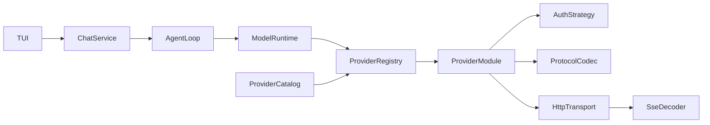

<!-- b4354486-0a26-4371-8e4a-0791e6156947 -->
---
todos:
  - id: "baseline-safety"
    content: "Capture the current build, test, install, provider, streaming, tool-call, configuration, and live-test behavior before structural changes."
    status: pending
  - id: "module-skeleton"
    content: "Create the modules/apps/resources/docs layout, per-module include/src/test boundaries, local CMake targets, and temporary migration compatibility targets."
    status: pending
  - id: "types-module"
    content: "Move and normalize provider-neutral values, errors, options, results, stream events, messages, tools, and model capabilities into ai::types."
    status: pending
  - id: "transport-module"
    content: "Introduce injectable typed HTTP transport, URL handling, retries, timeout, cancellation, TLS, and reusable incremental SSE framing."
    status: pending
  - id: "protocol-modules"
    content: "Extract independent OpenAI, Anthropic, and Gemini request/response/stream codecs with shared conformance fixtures."
    status: pending
  - id: "provider-runtime"
    content: "Implement provider descriptors, immutable registry, runtime composition, endpoint policy, model handles, validation, and capability negotiation."
    status: pending
  - id: "credentials-catalog"
    content: "Implement credential strategies, Antigravity OAuth outside the TUI, canonical provider/model descriptors, schema validation, and OpenCode import."
    status: pending
  - id: "agent-tools"
    content: "Create one AgentLoop for multi-turn generation and tool execution, and reduce provider runtimes to one model turn per call."
    status: pending
  - id: "application-modules"
    content: "Extract qcode configuration, application services, composition, and persistence interfaces from TUI concerns."
    status: pending
  - id: "tui-module"
    content: "Move FTXUI code into its private application module and switch selection, commands, generation, and compaction to stable application APIs."
    status: pending
  - id: "migrate-openai"
    content: "Migrate OpenAI Chat, Responses, OpenCode, OpenRouter, QPilot, and QGenie to protocol modules plus declarative provider presets."
    status: pending
  - id: "migrate-anthropic"
    content: "Migrate Anthropic generation and true incremental streaming to the provider runtime and shared transport."
    status: pending
  - id: "migrate-antigravity"
    content: "Migrate Antigravity Gemini envelopes, aliases, reasoning, tools, streaming, project selection, and OAuth to the new modules."
    status: pending
  - id: "test-boundaries"
    content: "Split tests by target, add contract/integration/live suites, verify dependency boundaries, and add install-tree consumer coverage."
    status: pending
  - id: "remove-legacy"
    content: "Delete compatibility targets, singleton registry, duplicate streams/tool loops/catalogs, URL sniffing, obsolete headers, and generic utility leftovers."
    status: pending
  - id: "quality-docs"
    content: "Enforce formatting/lint/include checks, finalize CMake exports/options, and document architecture, testing, and both provider-extension workflows."
    status: pending
isProject: false
---
# Workspace Modularization Redesign

## Architectural direction

The main maintainability problem is responsibility mixing: [`ProviderRegistry`](file:///home/abhi/project/qcode/include/ai/registry.h) creates clients and handles provider policy, [`BaseProviderClient`](file:///home/abhi/project/qcode/src/providers/base_provider_client.h) mixes transport with tool orchestration, the TUI owns configuration/authentication, and Antigravity depends on OpenAI internals. Replace this with explicit layers:



Use static C++ protocol modules plus JSON provider/model descriptors. Do not add binary plugin loading yet; it introduces ABI/versioning complexity without helping the current three native protocols.

## 1. Reorganize the workspace around ownership

Adopt a predictable top-level layout and make each directory correspond to one library or application responsibility:

```text
qcode/
├── apps/qcode-tui/
│   ├── application/{include/qcode/application,src}/
│   ├── composition/src/
│   ├── config/{include/qcode/config,src}/
│   ├── persistence/{include/qcode/persistence,src}/
│   └── tui/{include/qcode/tui,src}/
├── modules/
│   ├── types/{include/ai/types,src}/
│   ├── transport/{include/ai/transport,src}/
│   ├── providers/{include/ai/providers,src}/
│   ├── agent/{include/ai/agent,src}/
│   ├── tools/{include/ai/tools,src}/
│   └── protocols/
│       ├── anthropic/{include/ai/protocols/anthropic,src}/
│       ├── gemini/{include/ai/protocols/gemini,src}/
│       └── openai/{include/ai/protocols/openai,src}/
├── resources/providers/
├── tests/{contract,integration,live,unit}/
├── cmake/
└── docs/architecture/
```

Folder responsibilities are strict:

- Every module owns its own `include/` and `src/`. Its `include/` tree is the API available to downstream CMake targets; its `src/` tree and headers are private implementation details. There is no shared global include directory.
- `modules/types`: provider-neutral values only—messages, tools, usage, generation options/results, stream events, and errors. It performs no I/O and depends only on the standard library and JSON where unavoidable.
- `modules/transport`: HTTP, TLS, retries, cancellation, timeout, and SSE framing. It knows bytes, headers, and status codes, but never model names or tool semantics.
- `modules/protocols/<protocol>`: pure wire-format codecs for OpenAI, Anthropic, and Gemini. Each protocol is its own module and public API. It translates between SDK values and JSON/SSE events, but does not read credentials, execute HTTP, or orchestrate tools.
- `modules/providers`: provider descriptors, module registry, credential interfaces, endpoint policy, runtime composition, and built-in provider presets. A provider selects protocol + transport + auth; it does not duplicate those implementations.
- `modules/agent`: multi-turn generation, tool execution policy, capability checks, and conversation flow. It depends on provider abstractions, never concrete providers or the TUI.
- `modules/tools`: tool interfaces, implementations, and execution adapters. Tools do not know provider protocols or UI rendering.
- `resources/providers`: schema-validated provider/model descriptors only. Compatible providers and model catalog updates belong here.
- `apps/qcode-tui/config`: reads CLI/user/OpenCode configuration and converts it to canonical application configuration; it does not create clients or refresh tokens.
- `apps/qcode-tui/composition`: contains private wiring only and therefore has no public `include/`. It is the only application module allowed to choose concrete provider, credential, persistence, and transport implementations.
- `apps/qcode-tui/application`: `ChatService`, use cases, commands, and application events. It contains no FTXUI widgets and no raw HTTP.
- `apps/qcode-tui/persistence`: SQLite/session repositories behind application-facing interfaces; no rendering or provider dispatch.
- `apps/qcode-tui/tui`: FTXUI state adaptation, views, input handling, and rendering only. It calls application services and never resolves providers directly.
- `tests/unit`: mirrors one production module at a time; `tests/contract` verifies every provider/protocol against shared behavior; `tests/integration` checks module composition with fakes/local servers; `tests/live` contains opt-in external API checks.
- `cmake`: reusable target/options/install helpers; module source lists stay in each module's local `CMakeLists.txt`.
- `docs/architecture`: dependency rules, extension guides, and architectural decisions.

Allowed dependency direction is one-way: `types <- transport/protocol <- provider <- agent <- application <- tui`; composition may depend on all concrete modules solely to wire them. Persistence implements application-owned interfaces. Lower layers must never include from `apps/`, and sibling protocols/providers must never include each other's private headers.

- Use `modules/<module>/include/ai/<module>/` only for supported SDK API. Move the current application-only [`include/ai/tui/`](file:///home/abhi/project/qcode/include/ai/tui) headers under the matching `apps/qcode-tui/<module>/include/qcode/<module>/`; private implementation headers stay beside their `.cpp` files.
- Mirror source ownership in tests and CMake targets. Each module gets a local `CMakeLists.txt`, one public namespace, and only its declared dependencies; the root CMake file becomes options plus `add_subdirectory` calls.
- Prefer one primary class per header/source pair. Split large coordinators such as [`src/tui/chat_bus.cpp`](file:///home/abhi/project/qcode/src/tui/chat_bus.cpp) by use case, not arbitrary line count.
- Eliminate catch-all locations over time: move `utils` code to the owning domain (`transport/url`, `types/message`, `provider/id`) and reject new generic helpers without a clear owner.
- Keep `main.cpp` as a composition root only. Construction and dependency wiring belong there; business logic belongs in application services.
- Add `docs/architecture/dependencies.md`, `providers.md`, and `testing.md`, plus concise README navigation. Record allowed dependency directions and ownership decisions rather than documenting every implementation detail.
- Apply the existing `.clang-format` and `.clang-tidy` in CI to first-party files only. Add include self-containment, header/source naming, dependency-boundary, and formatting checks so the organization does not decay.

## 2. Establish stable provider contracts

- Add public contracts under `modules/providers/include/ai/providers/`: `ProviderModule`, `ProviderDescriptor`, `ProviderInstanceConfig`, `ModelDescriptor`, `ModelCapabilities`, `CredentialProvider`, and immutable `ModelHandle`.
- Let instance configuration carry validated protocol-specific JSON options rather than expanding a fixed [`ProviderOptions`](file:///home/abhi/project/qcode/include/ai/registry.h) for every provider.
- Make the registry an injected, immutable collection of modules; remove singleton startup ordering, silent registration overrides, and unknown-provider fallback.
- Distinguish provider identity from protocol identity: OpenRouter/OpenCode/QPilot are presets using `openai_chat` or `openai_responses`; OpenAI, Anthropic Messages, and Gemini GenerateContent are protocol modules.

## 3. Separate transport, protocol, and orchestration

- Split the broad core currently assembled in [`CMakeLists.txt`](file:///home/abhi/project/qcode/CMakeLists.txt) into `ai::types`, `ai::http`, `ai::stream-sse`, `ai::provider-runtime`, `ai::tool-runtime`, and `ai::tools-builtin`.
- Replace transport-to-domain metadata conversion with typed `HttpRequest`, `HttpResponse`, and `TransportError` values. Inject transport into provider runtimes for deterministic tests.
- Centralize TLS, retries, timeout, cancellation, URL composition, and SSE framing; protocol modules only encode requests and decode responses/events.
- Extract reusable `ai::protocol-openai`, `ai::protocol-anthropic`, and `ai::protocol-gemini` targets. Antigravity must depend on protocol/runtime targets, not `ai::openai`.
- Move every multi-step tool loop out of provider clients and [`src/tui/chat_bus.cpp`](file:///home/abhi/project/qcode/src/tui/chat_bus.cpp) into one `AgentLoop`; each provider call performs exactly one model turn.

## 4. Make compatible providers declarative

- Define one canonical JSON schema for provider presets and model catalogs: stable ID, display name, protocol ID, base URL, endpoint policy, auth reference, static headers, model aliases, limits, costs, and capabilities.
- Keep OpenCode configuration support as an importer into this canonical model, rather than making [`src/tui/config.cpp`](file:///home/abhi/project/qcode/src/tui/config.cpp) the domain model.
- Resolve secrets lazily through injected strategies (`environment`, `file`, `OAuth refresh`, optional static value); descriptors contain references, never copied plaintext credentials.
- Honor model-level protocol/capability overrides during resolution. Replace duplicated model constants/catalogs with the canonical catalog; retain only a small curated constants header if the public SDK benefits from it.
- Target workflow: adding an OpenAI-compatible provider requires one descriptor plus fixtures—no registry branch, provider class, TUI change, or CMake edit.

## 5. Isolate application and TUI concerns

- Create `qcode::config`, `qcode::provider-composition`, `qcode::chat-service`, `qcode::persistence`, `qcode::tui-model`, and `qcode::tui-render` libraries under `apps/qcode-tui`.
- Replace provider/model vector indexes with an immutable `{provider_instance_id, model_id}` handle validated at selection time.
- Make `ChatService` own resolution, capability checks, compaction calls, and `AgentLoop`; the TUI should only publish commands/events and render state.
- Move Antigravity OAuth refresh from TUI configuration into an `OAuthCredentialProvider` owned by application composition.
- Remove provider/model substring checks from UI code; reasoning, tools, streaming, and limits come from typed model capabilities.

## 6. Rebuild tests around module contracts

- Split the monolithic test executable in [`tests/CMakeLists.txt`](file:///home/abhi/project/qcode/tests/CMakeLists.txt) by component so dependency violations fail at link/compile time.
- Add protocol conformance fixtures covering text, multipart content, reasoning, tools/results, usage, errors, streaming, cancellation, and exactly-one-finish behavior.
- Run each provider module against a shared contract suite with fake credential and transport implementations.
- Add catalog/schema validation and an end-to-end test that loads a descriptor-only provider and generates through a fake OpenAI-compatible server.
- Keep live tests opt-in and provider-specific; they verify credentials/endpoints but are not required for normal CI.

## 7. Migrate incrementally, then delete legacy paths

- Build the new contracts and transport alongside existing clients.
- Migrate OpenAI first, then Anthropic, then Antigravity; after each migration, route the TUI through `ChatService` and run the provider contract suite.
- Replace [`src/providers/registry.cpp`](file:///home/abhi/project/qcode/src/providers/registry.cpp), `ProviderInfo`/`ModelInfo`, duplicated stream implementations, URL hostname sniffing, and old tool loops only after all providers use the new path.
- Add component build options, CMake `EXPORT_NAME`s, correct installed transitive dependencies, and stop installing TUI headers unless backed by exported libraries.
- Document two extension recipes: descriptor-only compatible provider and native protocol module.

## Detailed execution sequence

Each step must leave the normal build green. Structural moves and behavior changes should be separate commits so regressions can be located and reviewed.

### 1. Baseline safety

- Record supported build combinations, CTest inventory, install/export behavior, and current public headers.
- Add missing characterization tests around provider resolution, endpoint construction, OpenCode config import, Antigravity token refresh, streaming termination, reasoning signatures, and tool-call round trips.
- Separate external live checks from deterministic tests and document required environment variables.
- Gate: existing debug build, release build, offline tests, and authorized live provider checks pass before files move.

### 2. Module skeleton

- Create the `modules/`, `apps/qcode-tui/`, `resources/providers/`, and `docs/architecture/` hierarchy.
- Give every module a local `CMakeLists.txt`, namespaced target, public `include/`, private `src/`, and focused test target.
- Add temporary forwarding headers/aliases only where needed to keep migration incremental; mark each one for deletion.
- Reduce the root CMake file to project options, dependency discovery, module inclusion, install/export setup, and configuration summary.
- Gate: old implementation still builds through the new target graph with no behavior change.

### 3. Types module

- Move messages, content parts, tool descriptions/calls/results, usage, models, generation/embedding/stream options and results, errors, and enums into `ai::types`.
- Consolidate `ModelInfo`, `Model`, and provider capability metadata into one immutable model descriptor.
- Remove transport status codes and provider-specific reasoning formats from generic metadata fields; introduce typed fields where cross-provider semantics exist.
- Keep JSON conversion helpers near the owning type only when they are provider-neutral.
- Gate: `ai::types` has no dependency on transport, providers, tools, TUI, SQLite, or FTXUI.

### 4. Transport module

- Define `HttpRequest`, `HttpResponse`, `HttpHeaders`, `TransportError`, cancellation token, timeout policy, and retry policy.
- Inject an `HttpTransport` interface into runtimes; provide httplib production and fake test implementations.
- Implement URL parsing/composition once and remove endpoint concatenation from clients.
- Implement one incremental SSE reader responsible for framing, reconnect/error rules, cancellation, and exactly-once completion.
- Gate: transport tests use local/fake endpoints and contain no provider JSON knowledge.

### 5. Protocol modules

- Define codec interfaces for request encoding, success/error decoding, and incremental stream event decoding.
- Move OpenAI Chat and Responses handling into the OpenAI protocol module without hostname/provider checks.
- Move Anthropic Messages request/response/event logic into its own protocol module.
- Move Gemini message, envelope, function-call, reasoning-signature, alias, and stream normalization into its own protocol module.
- Add shared fixture cases for text, multipart content, reasoning, tools, tool results, usage, errors, malformed events, and finish reasons.
- Gate: protocol tests are pure and require neither credentials nor network access.

### 6. Provider runtime

- Introduce `ProviderDescriptor`, `ProviderInstanceConfig`, `ModelDescriptor`, `ModelHandle`, `ProviderModule`, `CredentialProvider`, and `ProviderRuntime`.
- Replace the mutable singleton registry with an explicitly constructed immutable registry that rejects duplicate and unknown IDs.
- Resolve provider + model once; carry a validated handle instead of rescanning vectors or using indexes.
- Validate endpoint, protocol availability, credentials, and requested capabilities before starting a request.
- Gate: registry and runtime tests use fake protocol, transport, and credential implementations.

### 7. Credentials and catalogs

- Add environment, configured-value, file-token, and OAuth-refresh credential strategies.
- Move Antigravity token loading/refreshing out of TUI configuration and avoid copying resolved secrets into UI state or provider catalogs.
- Define and validate the canonical provider/model JSON schema under `resources/providers/`.
- Convert OpenCode configuration into canonical descriptors through a dedicated importer, preserving environment references, headers, model-level protocol overrides, costs, and limits.
- Represent compatible providers as descriptors selecting a protocol, auth strategy, endpoint policy, headers, and models.
- Gate: malformed catalogs produce actionable validation errors and secrets are resolved only when constructing a request.

### 8. Agent and tools

- Define one provider-neutral `AgentLoop` that owns multi-step generation, tool execution, duplicate-call prevention, maximum-step policy, cancellation, and event callbacks.
- Make provider runtimes execute exactly one model turn and never invoke local tools.
- Move built-in Bash and task tools behind tool interfaces and keep their process/filesystem policy outside provider code.
- Ensure streaming and non-streaming paths emit the same typed application events.
- Gate: one deterministic suite covers no-tool, one-tool, multiple-tool, error, cancellation, and maximum-step scenarios.

### 9. Application, persistence, and composition

- Extract `ChatService`, model selection, compaction, session use cases, and application events from TUI implementation.
- Define repository interfaces in the application module and implement SQLite details in persistence.
- Move config location discovery and OpenCode import into the config module.
- Keep concrete transport, provider, OAuth, repository, and UI wiring solely in the composition module.
- Gate: application services run headlessly in tests without FTXUI or a real database/network.

### 10. TUI module

- Move all current `include/ai/tui` APIs into the qcode application namespace and expose only headers needed between qcode targets.
- Split the large chat bus into input/controller, generation event adapter, state reducer, and rendering responsibilities.
- Replace provider/model indexes with validated `ModelHandle` values.
- Remove provider resolution, credential handling, model substring checks, HTTP knowledge, and tool orchestration from views and commands.
- Gate: TUI target depends on application-facing targets and FTXUI, not concrete protocol internals.

### 11. OpenAI-compatible migration

- Route OpenAI Chat and Responses through the shared runtime and OpenAI codec.
- Convert OpenCode, OpenRouter, QPilot, and QGenie to declarative presets unless a documented behavior requires a dedicated strategy.
- Replace hostname substring checks with descriptor fields for headers, endpoints, and protocol selection.
- Verify streaming, embeddings where supported, tools, reasoning, custom headers, and versioned base URLs.
- Gate: adding a sample compatible provider requires only a descriptor and fixtures.

### 12. Anthropic migration

- Register Anthropic explicitly and route requests through the Anthropic codec and shared transport.
- Replace buffered pseudo-streaming with incremental SSE processing.
- Verify system prompts, multipart messages, tool calls/results, reasoning where available, usage, cancellation, and errors.
- Gate: Anthropic has no dependency on OpenAI or TUI targets.

### 13. Antigravity migration

- Compose Antigravity from Gemini protocol, shared transport, OAuth credential provider, endpoint/project policy, and model descriptors.
- Preserve Gemini envelopes, model aliases, thought signatures, reasoning, tool calls/results, and stream normalization.
- Remove inheritance or inclusion of OpenAI private implementation headers; reuse only explicit public protocol abstractions where wire formats overlap.
- Verify token refresh plus minimal authorized text, streaming, and tool-call requests.
- Gate: Antigravity has no dependency on `ai::openai` or TUI configuration.

### 14. Test and package boundaries

- Split unit executables by module so each test links only its production target and deliberate test-support library.
- Add provider/protocol contract suites, local integration tests, isolated live executables, and an install-tree consumer project.
- Add dependency-boundary checks that reject includes from sibling private `src/` trees.
- Verify component build options and static/shared install exports on a clean build directory.
- Gate: all targets build without a global `src` include path or aggregate SDK dependency in focused tests.

### 15. Remove legacy paths

- Delete forwarding headers, compatibility CMake targets, old singleton registry, old provider factories/clients that are fully replaced, and duplicated stream implementations.
- Delete TUI-owned auth, duplicated model structures/catalogs, provider URL sniffing, duplicate tool loops, stale tests, and dead macros.
- Rehome or remove generic utilities based on actual ownership.
- Run an include/dependency audit to ensure no lower layer references application or UI code.
- Gate: repository search finds none of the documented temporary compatibility symbols.

### 16. Quality and documentation

- Apply `.clang-format` and `.clang-tidy` consistently to first-party targets; enable warnings-as-errors after existing warnings are resolved.
- Add CI checks for formatting, lint, self-contained public headers, architecture boundaries, tests, install-tree usage, and descriptor schema validation.
- Document the target tree, dependency direction, public/private API rules, test taxonomy, configuration import, and credential lifecycle.
- Add step-by-step guides for a descriptor-only compatible provider and a new native protocol module.
- Gate: a contributor can add the documented sample provider without touching registry, TUI, root CMake, or unrelated source files.

## Completion criteria

- A compatible provider/model is added through one descriptor and tests only.
- A native protocol implementation never modifies registry, TUI, or unrelated providers.
- Authentication is reusable outside the TUI and secrets are not copied into UI state.
- Providers share one transport/SSE implementation and one agent/tool loop.
- Every first-party directory has a single documented owner and dependency direction; SDK, application, resources, and tests no longer share public headers accidentally.
- `main.cpp` contains wiring only, generic `utils` no longer grows, and formatting/lint/boundary checks enforce the intended structure.
- Component tests link only declared dependencies, install-tree consumer tests pass, and all existing provider behaviors remain covered during migration.
